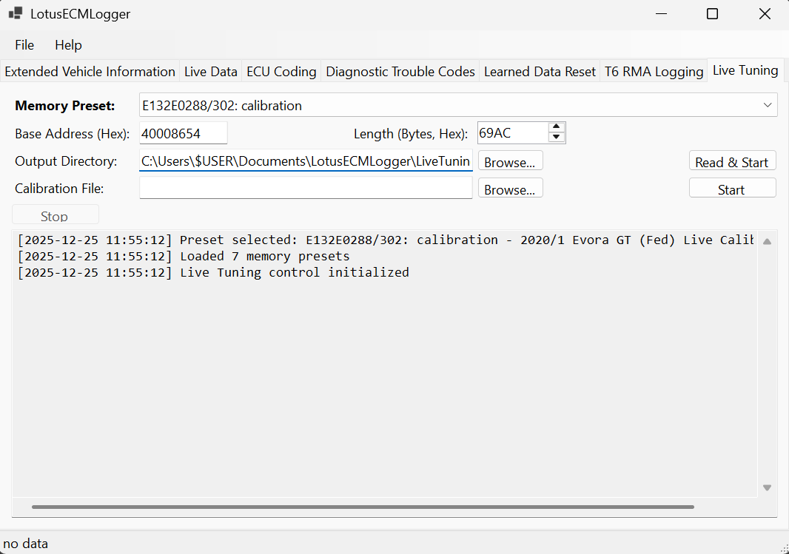

# LotusECMLogger

**LotusECMLogger** is a free, open-source logging tool designed specifically for Lotus sports cars. It supports both standard OBD-II Mode 01 and manufacturer-specific OBD-II Mode 22, enabling you to capture a wide range of engine and vehicle data.

With LotusECMLogger, you can log not only generic OBD-II parameters, but also Lotus-specific data such as variable cam control, knock control, and other advanced diagnostics. This makes it an invaluable tool for enthusiasts, tuners, and anyone interested in monitoring or troubleshooting their Lotus vehicle.

- **Supports OBD-II Mode 01**: Standard parameters like RPM, speed, coolant temperature, etc.
- **Supports OBD-II Mode 22**: Manufacturer-specific channels, including advanced Lotus data.
- **Capture Lotus-specific data**: Log unique parameters such as variable cam control, knock control, and more.
- **Free and open source**: No cost, no restrictions, and community-driven development.

## Requirements

- **Lotus Vehicle with CAN**: This should be any 2008+ model.
- **x86 Windows Computer**: Tested with Windows 11, but Windows 7+ is supported. Note that the software is 32bit.
- **J2534-compliant Pass-Thru Device**: This is a widely supported industry stanard. Beware cheap devices that are not standards compliant.

## Supported Adapters

LotusECMLogger should work with an J2534-compliant pass-thru device connected via USB. Popular options include:

- **Tactrix OpenPort 2.0**: (discontinued) A widely used J2534 device known for its reliability and performance.
- **TopDon RLink X3**: Requires J2534 driver download from TopDon

## Known Incompatible Adapters

- **GO-DIAG GD101**: Low-cost device. Known to have driver issues and is not recommended.

## User Interface Features

LotusECMLogger provides a tabbed interface with specialized tools for different diagnostic and logging tasks:

### Vehicle Information
The Vehicle Information tab retrieves static and learned data from the ECU. It queries OBD-II Mode 09 for identification data — VIN, ECU name, calibration ID, and calibration verification number (displayed as hex) — and Mode 22 for per-cylinder octane scaler values, which indicate how much knock-based fuel correction has been accumulated for each cylinder. A **Learned Data Reset** button on this tab performs an OBD-II Mode 0x11 reset to clear adaptive learning values, which may be necessary after certain repairs or modifications.

### Live Data
The Live Data tab contains two sub-tabs:

**Logger** — Displays real-time OBD-II parameters from your Lotus vehicle in an easy-to-read list. You can start and stop logging sessions, which automatically saves data to CSV files in your Documents folder for later analysis. The active logging configuration is selected from a dropdown; configurations determine which ECUs and PIDs are polled each session. Wideband calibration parameters (slope and offset for each bank, PID 0x0403/0x0404) are supported for vehicles equipped with wideband sensors.

**Logging Config** — A full configuration editor for creating and managing logging configuration files. You can add and remove ECUs, set each ECU's CAN request and response IDs, and build a list of OBD requests (Mode 01 or Mode 22) with names, descriptions, categories, units, and PID values. Configurations are saved as JSON files and are immediately available in the Logger sub-tab without restarting the application.

### ECU Coding
The ECU Coding tab allows you to read and modify ECU configuration settings for Lotus T6e ECUs. You can view current coding values, make changes to vehicle configuration options, and write the updated settings back to the ECU with automatic backup creation for safety.

### Diagnostic Trouble Codes
The Diagnostic Trouble Codes (DTC) tab provides functionality for reading and clearing diagnostic trouble codes from the ECU. This feature helps you diagnose issues and monitor fault codes stored in your vehicle's engine management system.

### T6 RMA Logging
The T6 RMA (Remote Memory Access) Logging tab enables direct reading of ECU memory addresses for advanced diagnostics and development. You can specify any valid RAM address (0x40000000-0x4000FFFF), configure the number of bytes to read and polling interval, then log the data as a time series to CSV. This feature requires a debug-enabled ECU with developer calibration and provides real-time hex dump, ASCII, and numeric interpretations of the memory contents.

### T6 Live Tuning
The T6 Live Tuning tab enables real-time calibration editing by monitoring .CPT calibration files and automatically writing changes to ECU memory. This feature supports two workflows: reading memory directly from the ECU to create a new calibration file, or loading an existing .CPT file for monitoring. Memory presets are available for common calibration regions. When monitoring is active, any edits made to the .CPT file are detected within 100ms and immediately written to the corresponding ECU memory address, with detailed logging showing the memory address, file offset, and old/new values for each change. This requires a debug-enabled ECU with developer calibration.

### T6E Calibration Flasher
Available from the **File** menu, the T6E Calibration Flasher provides a convenient interface for flashing ECU calibrations to Lotus T6e engine control units. The tool supports both .CRP and .CPT file formats, automatically converting .CPT files to XTEA-encrypted .CRP format (CRP08) before flashing to ensure compatibility with the ECU's flash programming protocol.