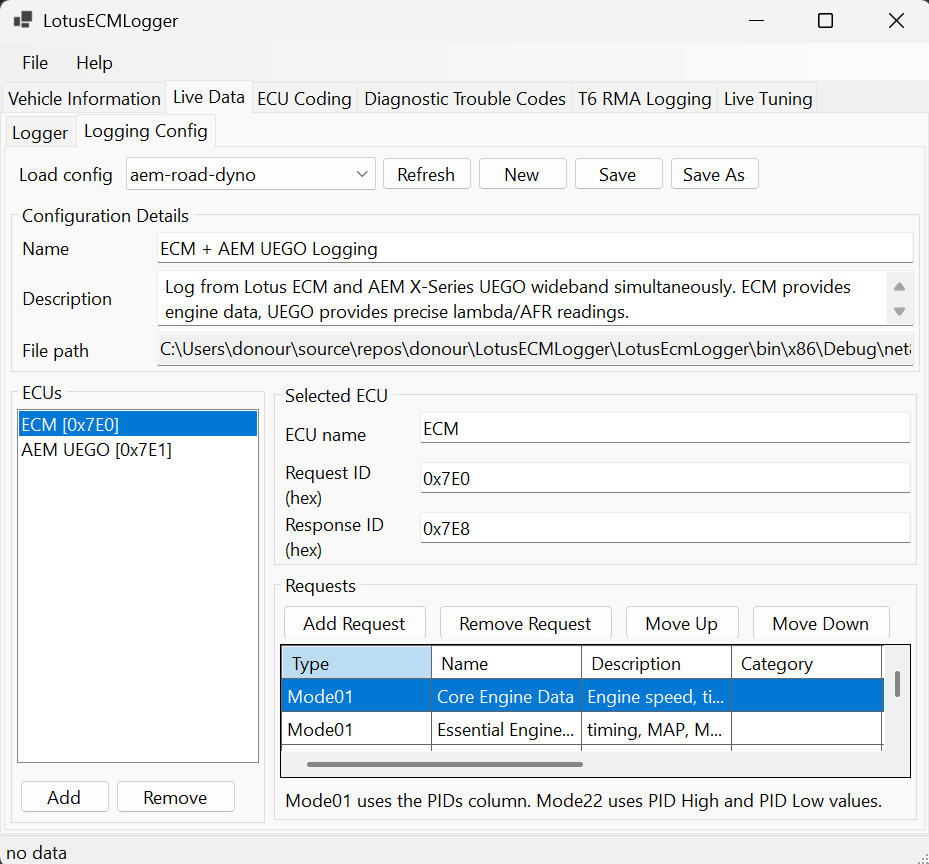

# LotusECMLogger

**LotusECMLogger** is a free, open-source logging tool designed specifically for Lotus sports cars. It supports both standard OBD-II Mode 01 and manufacturer-specific OBD-II Mode 22, enabling you to capture a wide range of engine and vehicle data.

With LotusECMLogger, you can log not only generic OBD-II parameters, but also Lotus-specific data such as variable cam control, knock control, and other advanced diagnostics. This makes it an invaluable tool for enthusiasts, tuners, and anyone interested in monitoring or troubleshooting their Lotus vehicle.

- **Supports OBD-II Mode 01**: Standard parameters like RPM, speed, coolant temperature, etc.
- **Supports OBD-II Mode 22**: Manufacturer-specific channels, including advanced Lotus data.
- **Capture Lotus-specific data**: Log unique parameters such as variable cam control, knock control, and more.
- **High-speed channel logging**: Stream internal ECU channels over CAN at up to 100 Hz per channel — far faster than OBD-II polling — with optional AEM X-Series wideband integration.
- **ECU configuration & diagnostics**: Read and modify ECU coding, read and clear trouble codes (including permanent codes), program the VIN, and reset learned/adaptive data.
- **Dyno mode**: Enable the ECU's diagnostic override to suppress faults from external systems (such as ABS) during dyno runs.
- **Advanced T6e tools**: RAM (RMA) logging, live calibration tuning, calibration flashing, and model-info erase for firmware migration.
- **Free and open source**: No cost, no restrictions, and community-driven development.

## Requirements

- **Lotus Vehicle with CAN**: This should be any 2008+ model.
- **x86 Windows Computer**: Tested with Windows 11, but Windows 7+ is supported. Note that the software is 32bit.
- **J2534-compliant Pass-Thru Device**: This is a widely supported industry standard. Beware cheap devices that are not standards compliant.

## Supported Adapters

LotusECMLogger should work with an J2534-compliant pass-thru device connected via USB. Popular options include:

- **Tactrix OpenPort 2.0**: (discontinued) A widely used J2534 device known for its reliability and performance.
- **TopDon RLink X3**: Requires J2534 driver download from TopDon

## Known Incompatible Adapters

- **GO-DIAG GD101**: Low-cost device. Known to have driver issues and is not recommended.

## User Interface Features

LotusECMLogger provides a tabbed interface with specialized tools for different diagnostic and logging tasks:

### Vehicle Information
The Vehicle Information tab retrieves static and learned data from the ECU. It queries OBD-II Mode 09 for identification data — VIN, ECU name, calibration ID, and calibration verification number (displayed as hex) — and Mode 22 for per-cylinder octane scaler values, which indicate how much knock-based fuel correction has been accumulated for each cylinder. After a load, the tab probes the ECU over raw CAN and shows two indicators: an **unlock indicator** — UNLOCKED, LOCKED, or UNKNOWN — since an unlocked ECU is required for advanced operations such as Erase Model Info, T6 RMA Logging, and Live Tuning, and an **HS LOGGER indicator** showing whether the installed firmware provides the high-speed channel-logger facility used by the High-Speed Log tab.

The tab also hosts three operations:

- **Set VIN** — Opens a dialog that programs a new VIN using OBD-II Mode 0x3B. The Lotus firmware only allows positions 4–17 to be rewritten (the `SCC` WMI is fixed), validates the entry as you type, and requires the engine to be off; the result is verified by reading the VIN back after programming.
- **Dyno Mode** — Enables the ECU's diagnostic override (OBD-II Mode 0x2F), which inhibits fault reactions triggered by external systems such as ABS. This is useful on a chassis dyno, where driven and undriven wheels turning at different speeds would otherwise raise faults and trigger torque intervention. Dyno mode is not persistent — it clears when the vehicle is powered off, and there is no explicit disable command, so cycle the ignition to return to normal operation. Only enable it on a dyno or during controlled testing: suppressing ABS-related faults on the road removes safety interventions.
- **Adaptations Reset** — Performs an OBD-II Mode 0x11 reset to clear adaptive learning values (octane scalers, knock retard, alpha-N load trim, torque-to-throttle scaling, per-bank fuel trim, and idle learning), which may be necessary after certain repairs or modifications.

### Logging
All logging tools live under a single Logging tab, with sub-tabs for each logging mode. Every logger writes its CSV output beneath one folder — `Documents\LotusECMLogger` — with per-mode file names (`HighSpeed_<timestamp>.csv`, `LiveData_<timestamp>.csv`, `T6RMA_<timestamp>.csv`).

**High-Speed Log** — Streams internal ECU channels directly over CAN at up to 100 Hz per channel, far faster than OBD-II polling. Instead of request/response messages, it programs the ECU as an autonomous sampler that broadcasts the channels you select, making it possible to capture fast transients such as per-cylinder ignition advance and knock retard, throttle and pedal movement, AFR, MAF, load, and torque. Channels are loaded from JSON presets (per ECU calibration version) into a spreadsheet-style grid where you check the channels to log and pick a per-channel sample rate. A **Test Connection** button verifies that the ECU firmware includes the channel-logger facility before you start — standard locked production calibrations generally do not have it. An **AEM Wideband** toggle polls an AEM X-Series wideband (OBDII variant) over OBD-II in parallel and merges lambda/AFR into the CSV as extra columns. Live status shows frame counts, drop counts, and last-update time while logging.

**OBD-II Logging** — Contains two sub-tabs:

- *Logger* — Displays real-time OBD-II parameters from your Lotus vehicle in an easy-to-read list. You can start and stop logging sessions, which automatically saves data to CSV files for later analysis. The active logging configuration is selected from a dropdown; configurations determine which ECUs and PIDs are polled each session. Wideband sensors are fully supported: live lambda and air-fuel ratio (Mode 01 PIDs 0x24/0x25) plus the per-bank calibration parameters (slope and offset, Mode 22 PIDs 0x0403/0x0404).
- *Logging Config* — A full configuration editor for creating and managing logging configuration files. You can add and remove ECUs, set each ECU's CAN request and response IDs, and build a list of OBD requests (Mode 01 or Mode 22) with names, descriptions, categories, units, and PID values. Configurations are saved as JSON files and are immediately available in the Logger sub-tab without restarting the application.

**T6 RMA Logging** — The T6 RMA (Remote Memory Access) sub-tab enables direct reading of ECU memory addresses for advanced diagnostics and development. You can specify any valid RAM address (0x40000000-0x4000FFFF), configure the number of bytes to read and polling interval, then log the data as a time series to CSV. This feature requires a debug-enabled ECU with developer calibration and provides real-time hex dump, ASCII, and numeric interpretations of the memory contents.

### ECU Coding
The ECU Coding tab allows you to read and modify ECU configuration settings for Lotus T6e ECUs. You can view current coding values, make changes to vehicle configuration options, and write the updated settings back to the ECU with automatic backup creation for safety.

### Diagnostic Trouble Codes
The Diagnostic Trouble Codes (DTC) tab reads both stored trouble codes (OBD-II Mode 03) and permanent trouble codes (Mode 0A) from the ECU, listing each code alongside its category to help you diagnose issues and monitor faults stored in your vehicle's engine management system. The **Clear Codes** button clears stored codes and freeze-frame data (Mode 04) after confirmation; permanent codes cannot be cleared directly and only extinguish after the ECU verifies the underlying fault is gone over subsequent drive cycles.

### Live Tuning
The Live Tuning tab enables real-time calibration editing by monitoring .CPT calibration files and automatically writing changes to ECU memory. This feature supports two workflows: reading memory directly from the ECU to create a new calibration file, or loading an existing .CPT file for monitoring. Memory presets are available for common calibration regions. When monitoring is active, any edits made to the .CPT file are detected within 100ms and immediately written to the corresponding ECU memory address, with detailed logging showing the memory address, file offset, and old/new values for each change. This requires a debug-enabled ECU with developer calibration.

### T6E Calibration Flasher
Available from the **Tools** menu, the T6E Calibration Flasher provides a convenient interface for flashing ECU calibrations to Lotus T6e engine control units. The tool supports both .CRP and .CPT file formats, automatically converting .CPT files to XTEA-encrypted .CRP format (CRP08) before flashing to ensure compatibility with the ECU's flash programming protocol.

The flasher does not program the ECU directly. It prepares the calibration file and launches **EFI_PROT.EXE** — the external T6 flash programming utility (part of the T6_ECU_FIX package) — which then carries out the flash from its own console window. When EFI_PROT starts, you select the J2534 pass-thru device to use, so make sure the device is connected first. The vehicle must be powered off for the flashing procedure. Note that EFI_PROT must establish communication with the ECU within a limited time window; if it times out, the ECU locks out flashing. An ignition cycle does **not** clear this lockout — you must remove power from the ECU or wait several minutes before retrying — so be ready to proceed promptly once the tool launches.

### Erase Model Info
Available from the **Tools** menu, Erase Model Info clears the model identification stored in the ECU's variant coding so the currently installed firmware can re-initialize it. This is primarily used when migrating firmware versions: flashing a new calibration does not update the stored model info, so the ECU reports a program-version mismatch and the new firmware is not fully activated. Erasing the field (filling it with 0xFF) causes the firmware to re-seed it from the freshly flashed calibration's program version on its next coding-initialization cycle, committing the change to EEPROM. The operation requires an unlocked ECU and the correct firmware version to be selected (which resolves the target command-register address); it is disabled while logging is active and cannot be undone.

## Developer TODOs

### UI / UX
- **Tab and button icons are not visible in the Visual Studio designer.** Icons are applied at runtime using Segoe MDL2 Assets glyph rendering (`GuiIcons.cs`), but the WinForms designer only executes `InitializeComponent()` and does not run post-constructor code. Fix: pre-render glyphs to PNG and store them as embedded resources in the project `.resx` file, then reference them via `Properties.Resources` in `InitializeComponent()` so the designer can read and re-serialize them.
- **`MainWindow.OnLoggerStateChanged` has no user-facing error reporting.** It now logs any failure propagating logger state to child controls via `Debug.WriteLine`, but a failure is still invisible to the user at runtime. Consider surfacing it.

### Code Quality
- **`T6LiveTuningService.ReadEcuImageToFileAsync` is a stub.** The method validates arguments and logs but does not read ECU memory. Needs implementation: validate RAM address range (0x40000000–0x4000FFFF), read in chunks via `T6RMAService`, handle multi-frame reads, write binary output to file.
- **`T6eCodingDecoder` validation rules are incomplete.** Coding validation only covers a subset of models. Add validation rules for S2, Exige, and Emira variants.
- **`J2534EcuCodingService` program-mismatch repair is unimplemented.** When the ECU is unlocked, read the program-mismatch flag and, if set, optionally clear it by issuing the reset command through the coding handler (command register accepts values 1–7).
- **`J2534Compat` shim should eventually be removed.** It restores J2534-Sharp v1 throw-on-error semantics on top of the result-based v2 API. Long term, handle `J2534Result`/`J2534Result<T>` (`.IsSuccess`/`.Status`/`.IsTimeout`) explicitly at each call site and delete the shim.

### Protocol / Data
- **Throttle position scaling constant may not be portable.** `LiveDataReading.cs` uses a hard-coded divisor of 77 as the observed max raw throttle value, and PID 0x11 currently appears to be scaled twice (`raw * 100 / 77`, then `* 100 / 255`). Verify against the OBD spec and replace with a single documented or configurable scaling.