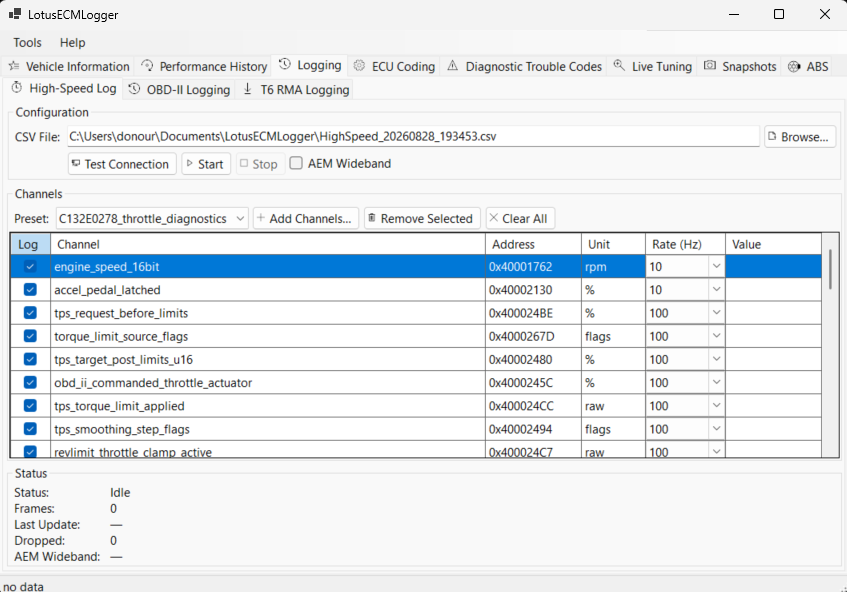

# LotusECMLogger

**LotusECMLogger** is a free, open-source logging and diagnostic tool designed specifically for Lotus sports cars. It supports both standard OBD-II Mode 01 and manufacturer-specific OBD-II Mode 22, enabling you to capture a wide range of engine and vehicle data.

With LotusECMLogger, you can log not only generic OBD-II parameters, but also Lotus-specific data such as variable cam control, knock control, and other advanced diagnostics. This makes it an invaluable tool for enthusiasts, tuners, and anyone interested in monitoring or troubleshooting their Lotus vehicle.

- **Supports OBD-II Mode 01**: Standard parameters like RPM, speed, coolant temperature, etc.
- **Supports OBD-II Mode 22**: Manufacturer-specific channels, including advanced Lotus data.
- **Performance history**: Read the Evora ECU's persistent usage histograms, standing-start results, top speeds/RPM, and retained low-oil/lateral-G events.
- **Capture Lotus-specific data**: Log unique parameters such as variable cam control, knock control, and more.
- **High-speed channel logging**: Stream internal ECU channels over CAN at up to 100 Hz per channel — far faster than OBD-II polling — with a searchable symbol catalog for picking channels and optional AEM X-Series wideband integration.
- **ECU configuration & diagnostics**: Read and modify ECU coding, read and clear trouble codes (including pending, permanent, and the Lotus service 0x13 "all codes" list), read freeze frames, program the VIN, and reset learned/adaptive data.
- **ABS/ESP diagnostics**: Read the Bosch ESP8 module's identification, coding and fault records, watch its 100 Hz wheel-speed broadcasts, read its internal state, and run the hydraulic bleed/test routines.
- **Dyno mode**: Enable the ECU's diagnostic override to suppress faults from external systems (such as ABS) during dyno runs.
- **Memory snapshots**: Download the ECU's learned-data, calibration, and program flash regions to binary files.
- **Advanced T6e tools**: RAM (RMA) logging, live calibration tuning, calibration flashing, CRP container pack/unpack, and model-info erase for firmware migration.
- **Free and open source**: No cost, no restrictions, and community-driven development.

## Requirements

- **Lotus Vehicle with CAN**: This should be any 2008+ model.
- **x86 Windows Computer**: Tested with Windows 11, but Windows 7+ is supported. Note that the software is 32bit.
- **.NET 10 Desktop Runtime (x86)**: Released builds are framework-dependent, so the 32-bit desktop runtime must be installed.
- **J2534-compliant Pass-Thru Device**: This is a widely supported industry standard. Beware cheap devices that are not standards compliant.

## Supported Adapters

LotusECMLogger should work with an J2534-compliant pass-thru device connected via USB. Popular options include:

- **Tactrix OpenPort 2.0**: (discontinued) A widely used J2534 device known for its reliability and performance.
- **TopDon RLink X3**: Requires J2534 driver download from TopDon

## Known Incompatible Adapters

- **GO-DIAG GD101**: Low-cost device. Known to have driver issues and is not recommended.

## Output Files

Every logger writes beneath one folder — `Documents\LotusECMLogger` — with per-mode, timestamped file names: `HighSpeed_<timestamp>.csv`, `LiveData_<timestamp>.csv`, `T6RMA_<timestamp>.csv`, and `ABS_Telemetry_<timestamp>.csv`. Memory snapshots default to the same folder as `.bin` files. If the application hits an unexpected error it also drops a `crash_<timestamp>.txt` report there and, where the fault is recoverable, keeps running rather than closing.

## User Interface Features

LotusECMLogger provides a tabbed interface with specialized tools for different diagnostic and logging tasks.

### Vehicle Information
The Vehicle Information tab retrieves static and learned data from the ECU. It queries OBD-II Mode 09 for identification data — VIN, ECU name, calibration ID, and calibration verification number (displayed as hex) — and Mode 22 for per-cylinder octane scaler values, which indicate how much knock-based fuel correction has been accumulated for each cylinder. After a load, the tab probes the ECU over raw CAN and shows two indicators: an **unlock indicator** — UNLOCKED, LOCKED, or UNKNOWN — since an unlocked ECU is required for advanced operations such as Erase Model Info, Snapshots, T6 RMA Logging, and Live Tuning, and an **HS LOGGER indicator** showing whether the installed firmware provides the high-speed channel-logger facility used by the High-Speed Log tab.

The tab also hosts three operations:

- **Set VIN** — Opens a dialog that programs a new VIN using OBD-II Mode 0x3B. The Lotus firmware only allows positions 4–17 to be rewritten (the `SCC` WMI is fixed), validates the entry as you type, and requires the engine to be off; the result is verified by reading the VIN back after programming.
- **Dyno Mode** — Enables the ECU's diagnostic override (OBD-II Mode 0x2F), which inhibits fault reactions triggered by external systems such as ABS. This is useful on a chassis dyno, where driven and undriven wheels turning at different speeds would otherwise raise faults and trigger torque intervention. Dyno mode is not persistent — it clears when the vehicle is powered off, and there is no explicit disable command, so cycle the ignition to return to normal operation. Only enable it on a dyno or during controlled testing: suppressing ABS-related faults on the road removes safety interventions.
- **Adaptations Reset** — Performs an OBD-II Mode 0x11 reset to clear adaptive learning values (octane scalers, knock retard, alpha-N load trim, torque-to-throttle scaling, per-bank fuel trim, and idle learning), which may be necessary after certain repairs or modifications.

### Performance History
The Performance History tab reads the persistent statistics published by Evora engine firmware through Mode 22 PIDs 0x0300–0x0361. Its **Overview** shows total engine runtime, recorded distance where the firmware provides it, standing-start counts and fastest/latest 0–100 and 0–160 km/h results. **Usage** presents the ECU's time-at-throttle, RPM, road-speed, coolant-temperature, and lateral-acceleration histograms. **Events** combines the five highest RPM and road-speed records with the three retained low-oil-pressure and high-lateral-G events, including the speed, RPM, peak lateral acceleration, and engine-runtime timestamp stored with each event.

The exact layout differs between the analysed B13200091 (S1), C132E0271 (Evora 400), C132E0278 (GT430), and E132E0288 (late Evora GT) firmware. The reader selects a profile from the calibration/program identifier so that PID 0x033A/0x0341 is interpreted as distance or the sixth lateral-G bucket as appropriate. Histogram thresholds are calibration constants that are not transmitted in the 0x03xx data; the Usage view shows the physical range values verified in each of the analysed firmware images alongside the ordered ECU band. An unrecognised calibration still reads, but only the fields whose meaning is common to every analysed variant are shown.

### Logging
All logging tools live under a single Logging tab, with sub-tabs for each logging mode.

**High-Speed Log** — Streams internal ECU channels directly over CAN at up to 100 Hz per channel, far faster than OBD-II polling. Instead of request/response messages, it programs the ECU as an autonomous sampler that broadcasts the channels you select, making it possible to capture fast transients such as per-cylinder ignition advance and knock retard, throttle and pedal movement, AFR, MAF, load, and torque.

Channels can be loaded two ways. JSON presets (per ECU calibration version, from `config/highSpeedLogger`) provide ready-made channel sets for tasks such as ignition tuning, fuel and closed-loop fuel diagnostics, fuel learning, throttle diagnostics, DPM diagnostics, and dyno tuning. **Add Channels…** opens a searchable picker backed by per-ECU symbol catalogs (Ghidra CSV exports in `config/highSpeedLogger/database`), where you filter named ECU variables by text and unit, hide arrays and calibration constants, multi-select, and add them with size, scale, and unit derived automatically from each symbol's type. Either way the channels land in a spreadsheet-style grid where you check the ones to log and pick a per-channel rate from 1, 2, 5, 10, 20, 50, or 100 Hz.

The selection is compiled into a logging program that respects the firmware's packing rules — at most 7 payload bytes per frame, 12 frames per group, and 10 groups — and same-rate groups are staggered across scheduler slots so they do not burst onto the bus together. A **Test Connection** button verifies that the ECU firmware includes the channel-logger facility before you start — standard locked production calibrations generally do not have it. An **AEM Wideband** toggle polls an AEM X-Series wideband (OBDII variant) over OBD-II in parallel and merges lambda/AFR into the CSV as extra columns, with live λ/AFR shown in the status panel. Live status also shows frame counts, drop counts, and last-update time while logging.

**OBD-II Logging** — Contains two sub-tabs:

- *Logger* — Displays real-time OBD-II parameters from your Lotus vehicle in an easy-to-read list, with current, minimum and maximum values per channel and a refresh-rate readout in the status bar. You can start and stop logging sessions, which automatically saves data to CSV files for later analysis. The active logging configuration is selected from a dropdown; configurations determine which ECUs and PIDs are polled each session. Wideband sensors are fully supported: live lambda and air-fuel ratio (Mode 01 PIDs 0x24/0x25) plus the per-bank calibration parameters (slope and offset, Mode 22 PIDs 0x0403/0x0404). Shipped configurations cover general-purpose and fast polling, misfire, knock-learning, fuel, torque, throttle and O2-sensor diagnostics, and AEM wideband setups.
- *Logging Config* — A full configuration editor for creating and managing logging configuration files. You can add and remove ECUs, set each ECU's CAN request and response IDs, and build a list of OBD requests (Mode 01 or Mode 22) with names, descriptions, categories, units, and PID values. Configurations are saved as JSON files and are immediately available in the Logger sub-tab without restarting the application.

**T6 RMA Logging** — The T6 RMA (Remote Memory Access) sub-tab enables direct reading of ECU memory addresses for advanced diagnostics and development. You can specify any valid RAM address (0x40000000-0x4000FFFF), configure the number of bytes to read and polling interval, then log the data as a time series to CSV. This feature requires a debug-enabled ECU with developer calibration and provides real-time hex dump, ASCII, and numeric interpretations of the memory contents.

### ECU Coding
The ECU Coding tab allows you to read and modify ECU configuration settings for Lotus T6e ECUs. You can view current coding values, make changes to vehicle configuration options, and write the updated settings back to the ECU with automatic backup creation for safety.

### Diagnostic Trouble Codes
The Diagnostic Trouble Codes tab has two sub-tabs.

**Standard OBD-II** reads stored trouble codes (Mode 03), pending codes (Mode 07) that have not yet confirmed into stored faults, and permanent trouble codes (Mode 0A) from the ECU, listing each code alongside a plain-English description and its category to help you diagnose issues and monitor faults stored in your vehicle's engine management system. Descriptions come from a table of roughly 3,000 codes shipped in `config/obd_ii_code_descriptions.json`, compiled from the [LotusECU-T4e](https://github.com/donour/LotusECU-T4e) OBD code documentation. The **Read Freeze Frame** button retrieves the sensor snapshot (Mode 02) the ECU captured at the moment a code set — the triggering DTC plus engine parameters such as RPM, coolant temperature, and fuel trims, with raw bytes shown for any parameter the application cannot decode. The **Clear Codes** button clears stored codes and freeze-frame data (Mode 04) after confirmation; permanent codes cannot be cleared directly and only extinguish after the ECU verifies the underlying fault is gone over subsequent drive cycles.

**Mode 0x13 (All Codes)** uses the Lotus proprietary service 0x13, which returns the current, confirmed and TPMS codes in a single round-trip. The response carries no group markers, so the codes are presented as one de-duplicated list next to the raw response bytes. Because this service exists only in Lotus firmware, the request form is selectable (`03 13 FF 00` or the bare `01 13`) and each choice is shown with the CAN frame it produces, which matters when a car does not answer.

### Live Tuning
The Live Tuning tab enables real-time calibration editing by monitoring .CPT calibration files and automatically writing changes to ECU memory. This feature supports two workflows: reading memory directly from the ECU to create a new calibration file, or loading an existing .CPT file for monitoring. Memory presets are available for common calibration regions. When monitoring is active, any edits made to the .CPT file are detected within 100ms and immediately written to the corresponding ECU memory address, with detailed logging showing the memory address, file offset, and old/new values for each change. This requires a debug-enabled ECU with developer calibration.

**Upload to ECU** writes a whole .CPT into running memory in one shot — the inverse of reading a region out to a file. The file's own length determines how much is written, starting at the base address. Before any data goes out, the first 32 bytes of the file are compared against the same bytes in ECU memory; if they differ the file almost certainly belongs to a different calibration, ECU, or region, and the upload stops with both headers shown so you can confirm or abandon it. After writing, the region is read back and compared against the file, since RMA writes are fire-and-forget and the ECU never acknowledges them. The transfer is not atomic — until it completes, a running engine is using a mix of the old and new calibrations — and only the RAM copy changes, so cycling the ignition restores the flashed calibration.

### Snapshots
The Snapshots tab takes one-shot binary downloads of the ECU's flash-resident regions over the T6 RMA read protocol, saving each to a `.bin` file:

- **Learned Data** — the persisted adaptive fuel, idle and knock trims.
- **Calibration** — the active calibration (fuel and ignition maps, limiters, and so on).
- **Program** — the compiled firmware. This is the largest region and may take several minutes.

An **ECU Version** selector (T4e, K4, T4, or T6/T6e) picks which generation's memory map is used, since each lays flash out differently; T6 is the default and this application's primary target. All three downloads require an unlocked ECU.

### ABS
The ABS tab talks to the Bosch ESP8 ABS/ESP module over KWP2000 (ISO 14230) on CAN. Everything except the actuation sub-tab is read-only: no service that alters persistent module state — variant recoding, memory writes, DTC clearing — is offered.

- **Module & Faults** — reads the module's identification and coding records and its fault codes, plus the addressing-discovery tools (**Test Connection** probing and a passive bus **sniff**) used to confirm which addresses a given car answers on.
- **Live State** — reads the module's internal RAM through ReadMemoryByAddress: surface friction (mu) estimates, EDC accumulators, valve positions, and brake pressures. Read-only and safe while driving.
- **Telemetry** — passively decodes the module's 100 Hz wheel-speed and status broadcasts, transmitting nothing, with an optional **Log to CSV** toggle.
- **Pump & Valves (untested)** — runs the hydraulic actuation routines used for brake bleeding and testing: quick valve cycle, pressure-hold test, bleed circulation, per-wheel cycle, full system test, and the published three-phase bleed sequence (30 s circulate, 10 s hold, 5 s cycle). These drive the pump motor and solenoid valves, so they demand a stationary vehicle with the ignition on, engine off, and brake released; a preconditions check and a stop control are provided.

## Tools Menu

### T6E Calibration Flasher
The T6E Calibration Flasher provides a convenient interface for flashing ECU calibrations to Lotus T6e engine control units. The tool supports both .CRP and .CPT file formats, automatically converting .CPT files to XTEA-encrypted .CRP format (CRP08) before flashing to ensure compatibility with the ECU's flash programming protocol.

The flasher does not program the ECU directly. It prepares the calibration file and launches **EFI_PROT.EXE** — the external T6 flash programming utility (part of the T6_ECU_FIX package) — which then carries out the flash from its own console window. When EFI_PROT starts, you select the J2534 pass-thru device to use, so make sure the device is connected first. The vehicle must be powered off for the flashing procedure. Note that EFI_PROT must establish communication with the ECU within a limited time window; if it times out, the ECU locks out flashing. An ignition cycle does **not** clear this lockout — you must remove power from the ECU or wait several minutes before retrying — so be ready to proceed promptly once the tool launches.

### Erase Model Info
Erase Model Info clears the model identification stored in the ECU's variant coding so the currently installed firmware can re-initialize it. This is primarily used when migrating firmware versions: flashing a new calibration does not update the stored model info, so the ECU reports a program-version mismatch and the new firmware is not fully activated. Erasing the field (filling it with 0xFF) causes the firmware to re-seed it from the freshly flashed calibration's program version on its next coding-initialization cycle, committing the change to EEPROM. The operation requires an unlocked ECU and the correct firmware version to be selected (which resolves the target command-register address); it is disabled while logging is active and cannot be undone.

### Unpack CRP File
Opens a .CRP flash container, decrypts it, and shows its chunk metadata as text. The decrypted firmware and calibration payloads can then be extracted to .bin files. This is a read-only inspection tool that never talks to the ECU.

### Create CRP File
Builds a .CRP flash container from a calibration (calrom) file, a firmware (prog) file, or both. You pick the target ECU type and the input files; each input is matched to that ECU's calrom/prog reference address automatically. Like the unpacker, it only reads local files and writes a CRP — it never talks to the ECU.

## Help Menu

**User Guide** opens an in-application, navigable guide to each tab and tool. **About LotusECMLogger** shows version and license information.

## Developer TODOs

### Architecture
- **Every diagnostic operation opens its own J2534 device session.** There are 26 `J2534Session.Open()` call sites across 15 service classes, and nine controls carry an `IsLoggerActive` flag whose only job is to disable themselves while another operation owns the device — which is why the UI is full of "stop logging to use X". Fix: a session broker that owns one open device and leases channels per operation, so DTC reads, vehicle info and ABS telemetry can run alongside logging. This is also the natural home for pass-thru device selection (see UI / UX), and would let most of the `IsLoggerActive` gating be deleted. Large change that touches every service — land regression tests first (see Code Quality).

### Stability
- **`OBDLoggerControl.SafeUIInvoke` uses blocking `Invoke`.** The J2534 polling thread blocks until the UI thread has processed each batch, so any UI hitch costs sample rate directly. It also stalls the error path: `Logger_ExceptionOccurred` is raised on the logger thread and marshalled with `Invoke`, and its handler calls `Stop()`, which joins the very thread parked inside that `Invoke` — the UI freezes until the 2 s and 1 s join timeouts expire. Fix: `BeginInvoke`, or better, have the worker publish to a snapshot and let a UI timer render it at a fixed rate.
- **A single transient bus error ends the logging session permanently.** Any exception in the logger loop stops logging and raises a modal dialog; there is no retry or reconnect. A dropped frame or a momentary interface glitch should not end a dyno pull.
- **`SetThreadExecutionState` is called on the hot path and cleared on the wrong thread.** `OBDLoggerControl.Logger_DataLogged` P/Invokes it on every UI batch where once at start and once at stop would do. `StopLogger` then clears it from the UI thread, but the flag is per-thread, so the logger thread's sleep-prevention request is only released as a side effect of that thread exiting. Fix: set and clear once, on a single thread.
- **Shutdown has four different teardown routes.** `MainWindow_FormClosing` explicitly stops only the OBD logger; the high-speed, RMA and ABS loggers stop through control disposal (`HighSpeedLogService.Dispose() => StopLogging()` and equivalents). That works, but it is an implicit ordering dependency that is easy to break by moving a control. There is also no confirmation when closing the window mid-log. Fix: one explicit shutdown path that stops every active logger and prompts if any were running.

### Performance
- **`LiveDataReading.ParseCanResponse` allocates on every sample.** It runs `ecu.Name.Contains("UEGO", OrdinalIgnoreCase)` — a string search — on every CAN response, and the multi-ECU path rebuilds each reading's name with `$"{prefix}{reading.name}"` every sample. At 100 Hz across ~30 readings that is thousands of short-lived strings per second. Fix: precompute an `IsUego` flag and the prefixed channel names once on `ECUDefinition`.

### Logging & Data Integrity
- **Log timing still follows the wall clock.** `RelativeTime_ms` is derived from `DateTime.Now` at the session start, so a system clock correction mid-session shifts it. (The midnight wrap is gone: rows now carry a full ISO 8601 timestamp with its UTC offset.) Fix: a `Stopwatch` started when the log file opens, for the loggers that do not already pass an adapter hardware timestamp.
- **Stale values are indistinguishable from fresh ones.** `CsvSampleSink` carries the last value forward for every column on every row — the behaviour the ECU's partial responses require — so a channel that stops responding keeps emitting its last reading with nothing marking it stale.

### UI / UX
- **Tab and button icons are not visible in the Visual Studio designer.** Icons are applied at runtime using Segoe MDL2 Assets glyph rendering (`GuiIcons.cs`), but the WinForms designer only executes `InitializeComponent()` and does not run post-constructor code. Fix: pre-render glyphs to PNG and store them as embedded resources in the project `.resx` file, then reference them via `Properties.Resources` in `InitializeComponent()` so the designer can read and re-serialize them.
- **`ThemeManager` is written but never called.** The light/dark helper over .NET 10's `Application.SetColorMode` exists and is unreferenced, so the application always follows the system default. Either wire it up — ideally with a persisted preference, see below — or drop it.
- **`MainWindow.OnLoggerStateChanged` has no user-facing error reporting.** It now logs any failure propagating logger state to child controls via `Debug.WriteLine`, but a failure is still invisible to the user at runtime. Consider surfacing it.
- **Nothing persists between runs.** `Properties/Settings.settings` is still an empty profile, so window size and position, the last-used OBD configuration, the high-speed preset, the ECU variant selection and the output directory all reset on every launch.
- **No J2534 device selection.** `J2534Session.Open` hard-codes `DiscoverAPIs().First()` and `OpenDevice("")`, so anyone with two interfaces registered cannot choose between them. With none installed, `.First()` throws "Sequence contains no elements" rather than saying the driver is missing. Fix: `FirstOrDefault()` with a clear message, plus a device picker (see Architecture).
- **No way to reach the logs from inside the app.** The active log path is shown as static text and there is no "Open log folder" action anywhere. One menu item.
- **Errors are reported exclusively through modal dialogs.** A `MessageBox` mid-drive or mid-pull blocks everything until someone reaches over to dismiss it. A status strip with a scrollback pane would suit the context better.
- **`OBDLoggerControl.StartLoggerButton_Click` sets `IsLogging = true` before validating the configuration**, so the early return on a missing config leaves Start disabled and Stop enabled with no logger running.

### Code Quality
- **`T6LiveTuningService.ReadEcuImageToFileAsync` is a stub.** The method validates arguments and logs but does not read ECU memory. Needs implementation: validate RAM address range (0x40000000–0x4000FFFF), read in chunks via `T6RMAService`, handle multi-frame reads, write binary output to file.
- **`T6eCodingDecoder` validation rules are incomplete.** Coding validation only covers a subset of models. Add validation rules for S2, Exige, and Emira variants.
- **`J2534EcuCodingService` program-mismatch repair is unimplemented.** When the ECU is unlocked, read the program-mismatch flag and, if set, optionally clear it by issuing the reset command through the coding handler (command register accepts values 1–7).
- **`J2534Compat` shim should eventually be removed.** It restores J2534-Sharp v1 throw-on-error semantics on top of the result-based v2 API. Long term, handle `J2534Result`/`J2534Result<T>` (`.IsSuccess`/`.Status`/`.IsTimeout`) explicitly at each call site and delete the shim.
- **Test coverage is uneven.** `LotusECMLogger.Tests` now covers `CsvSampleSink`, `DiscoveringSampleSink`, `LiveDataReading.ParseCanResponse`, the OBD configuration loaders, `PerformanceHistoryDecoder`, `FreezeFrameDecoder`, `Mode13Decoder`, and CRP pack/unpack round-trips. Still verified only by hand against a car: `T6eCodingDecoder`, `HighSpeedLogPlanner`, `SymbolCatalogLoader`, and the ABS decoders. All of them are pure functions over bytes and files and need no hardware, so extending coverage is the cheapest available safety net — close to a prerequisite for the session-broker work under Architecture.

### Protocol / Data
- **Throttle position scaling constant may not be portable.** `LiveDataReading.cs` uses a hard-coded divisor of 77 as the observed max raw throttle value, and PID 0x11 currently appears to be scaled twice (`raw * 100 / 77`, then `* 100 / 255`). Verify against the OBD spec and replace with a single documented or configurable scaling.
